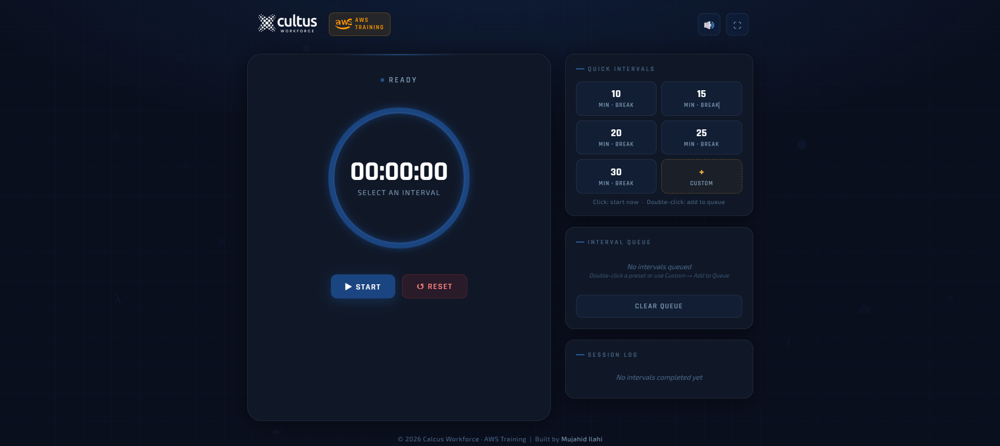
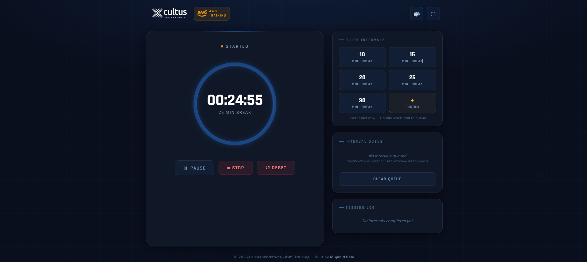
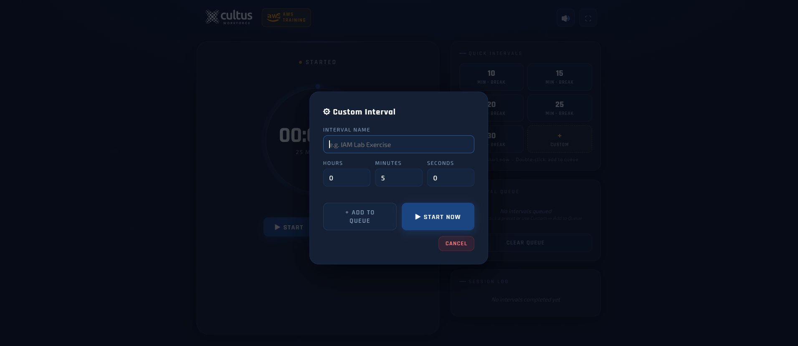

# ⏱️ Interval Timer Pro

> A beautiful, feature-rich interval timer for virtual classes, online training, workshops & remote teams — runs entirely in your browser. No install. No signup. No dependencies.

---

## 🏷️ Badges


---

## 📸 Screenshots

**Idle — Ready to Start**


**Timer Running**


**Custom Timer**


**Session Complete — Confetti 🎉**


---

## ✨ Features

- **⏳ Interval Timer** — count down from any custom duration with visual ring progress
- **📋 Queue System** — stack multiple intervals back-to-back; auto-advances when one ends
- **📝 Session Log** — automatically tracks every completed interval with timestamp and duration
- **🔊 Sound Alerts** — chime on start, tick beeps for first & last 5 seconds, finish fanfare
- **🎉 Confetti Celebration** — animated confetti burst when a session completes
- **⚡ Quick Presets** — one-click 10, 15, 20, 25, 30 min intervals + custom input
- **🌊 Particle Background** — subtle animated background that doesn't distract
- **🔲 Fullscreen Mode** — distraction-free full-screen for classroom display
- **🔇 Mute Toggle** — silence all sounds with one click
- **📱 Fully Responsive** — works on desktop, tablet, and mobile
- **🚦 Phase Indicators** — colour shifts from normal → warn → danger as time runs out
- **🗑️ Reset to Zero** — clean reset back to `00:00:00` at any time

---

## 🚀 Quick Start

**Option 1 — Direct download:**

1. Download `index.html`
2. Open it in any browser
3. Done ✅

**Option 2 — Clone:**

```bash
git clone https://github.com/ilahi123/interval-timer-pro.git
cd interval-timer-pro
open src/index.html
```

**Option 3 — GitHub Pages:**  
Fork this repo → Settings → Pages → Deploy from `main` branch → share the link with your class.

---

## 🖥️ How to Use

| Action          | How                                                  |
| --------------- | ---------------------------------------------------- |
| Start a preset  | Click any quick interval button (10, 15, 20…)        |
| Custom duration | Click **Custom**, enter minutes & seconds, hit Start |
| Queue intervals | Double-click a preset to add it to the queue         |
| Pause / Resume  | Use the Pause / Resume buttons mid-session           |
| Reset           | Click Reset — timer returns to `00:00:00`            |
| Mute sounds     | Click the 🔊 icon in the top bar                     |
| Fullscreen      | Click ⛶ in the top bar                               |

---

## 🎨 Visual Phases

| Phase   | Colour         | Trigger                                          |
| ------- | -------------- | ------------------------------------------------ |
| Normal  | 🔵 Blue        | Timer running with plenty of time left           |
| Warning | 🟡 Yellow      | Last 10% of duration (or 60s, whichever is less) |
| Danger  | 🔴 Red + shake | Last 3% of duration (or 15s, whichever is less)  |

---

## 📁 File Structure

```
interval-timer-pro/
├── src/
│   ├── index.html           ← entire app, one file
├── screenshots/
│   ├── screenshot-idle.png
│   ├── screenshot-running.png
│   ├── screenshot-custom.png
│   └── screenshot-finish.png
├── README.md
└── LICENSE
```

No build step. No `npm install`. No framework. Just open and use.

---

## 🌐 Use Cases

- 🏫 Virtual classrooms & online lectures
- 🏋️ Workout & HIIT training sessions
- 🧘 Meditation & breathing intervals
- 💼 Remote team workshops & sprints
- 🍅 Pomodoro productivity sessions
- 📢 Presentation & speech practice

---

## 🤝 Contributing

Pull requests are welcome! To contribute:

```bash
git fork https://github.com/ilahi123/interval-timer-pro.git
git checkout -b feature/your-feature-name
# make your changes to index.html
git commit -m "feat: describe your change"
git push origin feature/your-feature-name
```

Then open a Pull Request.

---

## 📄 License

MIT © [Mujahid Ilahi](https://github.com/ilahi123)  
Free to use, modify, and distribute.

---

## ⭐ Support

If this saved you time, give it a star — it helps others find it!  
[](https://github.com/ilahi123/interval-timer-pro)
